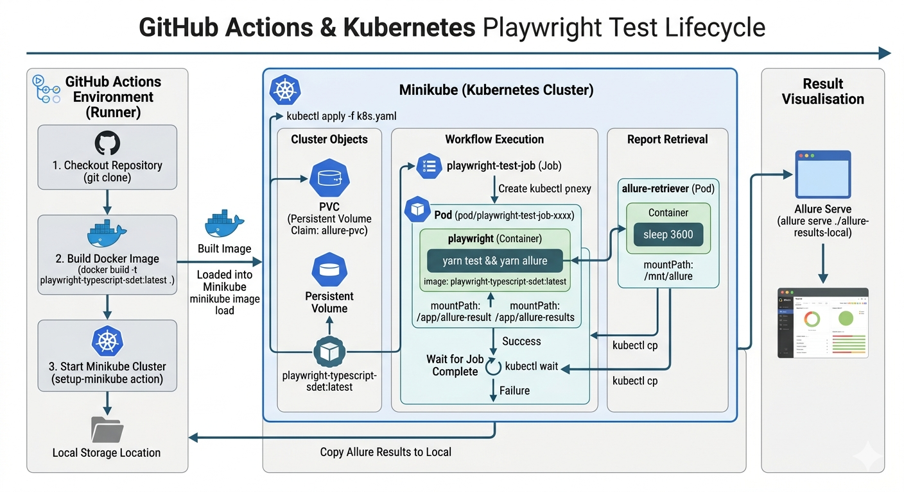

# Playwright SDET Test Boilerplate

Welcome to the Playwright SDET Test Boilerplate! This repository contains a boilerplate code setup specifically designed for candidates applying for a Software Development Engineer in Test (SDET) position. It provides a solid foundation to get you started with writing and running automated tests using Playwright.

## Scripts

### `yarn install`

Installs all the dependencies required for the project.

### `yarn test`

Runs all the test cases using Playwright.

### `yarn lint`

Checks the code for any linting errors using ESLint.

### `yarn lint:fix`

Automatically fixes the linting errors in the code.

### `yarn ci`

Runs the linting and test scripts in a continuous integration environment.

Run the playrights tests on local Minikube Cluster with k8s
Phase 1: Preparation & ExecutionRun these commands to set up the storage and execute the test suite.Ensure you are on the right cluster:

### `kubectl config use-context minikube`

Start Minikube
### `minikube start`

Minikube Status
### `minikube status`

Create the storage (PVC):
### `kubectl apply -f pvc.yaml`

Get the Job which was created earlier
### `kubectl get jobs`

Delete the Job which was created earlier
### `kubectl delete job playwright-test-job`

Run the Playwright tests:
###`kubectl apply -f k8s.yaml`

Monitor the progress:(Wait until the playwright-test-job pod shows Succeeded)
### `kubectl get pods`

View POD Logs
### `"kubectl logs -f <K8S_POD_NAME>`

Phase 2: Report RetrievalSince the job pod is finished, we use the retriever pod to "bridge" the data to the system.Start the helper pod:
### `kubectl apply -f allure-retriever.yaml`

Verify the retriever is running:
### `kubectl get pod allure-retriever`

Pull the data to your Mac:
### `kubectl cp allure-retriever:/mnt/allure ./allure-results-k8s`

Phase 3: Visualization & CleanupNow we view the results and tidy up the cluster resources.Open the report in your browser:
### `yarn report`

Cleanup Kubernetes (Optional but recommended):
### `kubectl delete job playwright-test-job`
### `kubectl delete pod allure-retriever`
Note: Keep the PVC if you want to keep the history, or run to wipe everything.
### `kubectl delete pvc allure-pvc` 

Quick Troubleshooting Cheat Sheet
If you see this...Run this...ImagePullBackOff 
### `minikube image load {docker hub registry}/playwright-typescript-sdet:latestPVC `
not found
### `kubectl get pvc (Ensure it is status Bound)`
Connection Refused
### `minikube start`

